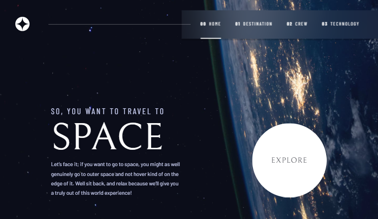

# Frontend Mentor - Space tourism website solution

This is a solution to the [Space tourism website challenge on Frontend Mentor](https://www.frontendmentor.io/challenges/space-tourism-multipage-website-gRWj1URZ3). Frontend Mentor challenges help you improve your coding skills by building realistic projects. 

## Table of contents

- [Frontend Mentor - Space tourism website solution](#frontend-mentor---space-tourism-website-solution)
  - [Table of contents](#table-of-contents)
  - [Overview](#overview)
    - [The challenge](#the-challenge)
    - [Screenshot](#screenshot)
    - [Links](#links)
    - [Built with](#built-with)
  - [Author](#author)

## Overview

### The challenge

Users should be able to:

- View the optimal layout for each of the website's pages depending on their device's screen size
- See hover states for all interactive elements on the page
- View each page and be able to toggle between the tabs to see new information

### Screenshot

### Links

- Solution URL: [https://www.frontendmentor.io/solutions/responsive-space-tourism-multipage-website-3PCK9wjgs5](https://www.frontendmentor.io/solutions/responsive-space-tourism-multipage-website-3PCK9wjgs5)
- Live Site URL: [https://space-tourism-self-six.vercel.app/](https://space-tourism-self-six.vercel.app/)

### Built with

- Semantic HTML5 markup
- Flexbox
- CSS Grid
- [React](https://reactjs.org/) - JS library
- [Styled Components](https://styled-components.com/) - For styles

## Author

- Frontend Mentor - [@lucasbsand](https://www.frontendmentor.io/profile/lucasbsand)
